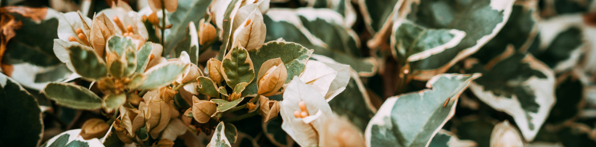

<h2 > Hi there 👋 </h2>

Call me <a href='https://linkedin.com/in/akhmadnabilgibran/' >Wylie or Nabil</a>, a developer based in Indonesia.

I’m an Full-Stack Web Developer with DevOps, and doing my best at coding a codebase that follow the best practice in industry. I have goal to build scalable, structured, optimized, efficient projects and infrastructure.

I love exploring and honing my skills, and working on various side project.

Side Notes :
- Almost all of my repository is private for security reason, kindly contact me if you are having a stake in that
- Orther than tech related things, i also like to learn histories.
- Chill games is my type of game.
- I love food

Links :
- My website https://nabilbuilds.my.id/
- LinkedIn https://www.linkedin.com/in/akhmadnabilgibran/

<h2 align="center"> 
   
</h2>

  

Banner by <a href="https://unsplash.com/@thainos?utm_content=creditCopyText&utm_medium=referral&utm_source=unsplash">Em Thain</a> on <a href="https://unsplash.com/photos/a-close-up-of-a-bush-with-leaves-and-flowers-SnoUxdmw7cY?utm_content=creditCopyText&utm_medium=referral&utm_source=unsplash">Unsplash</a>

  

